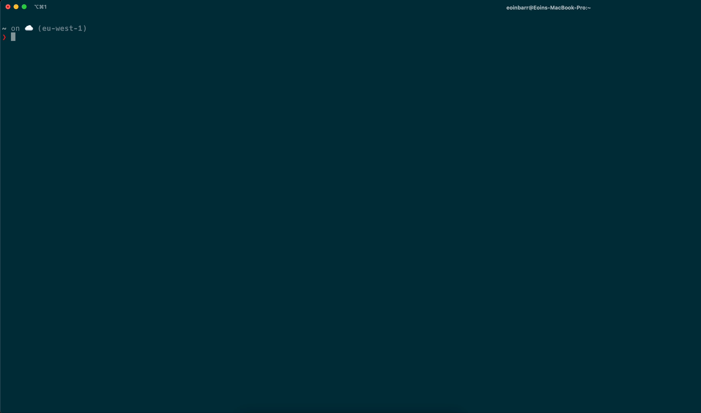

# Golang CLI Tool

## How to use

1. Run `brew tap eoin-barr/eoin-barr`

2. Run `brew install eoin-barr/eoin-barr/weatherme`

3. Enter `weatherme <city-name>` to see the weather in a city (use the `-a` flag for more granular weather details)